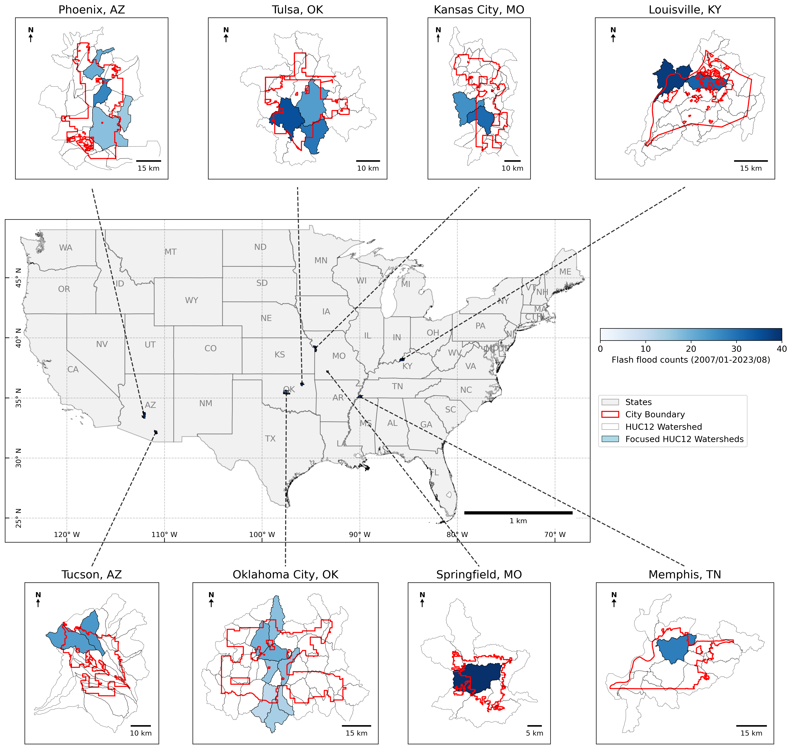
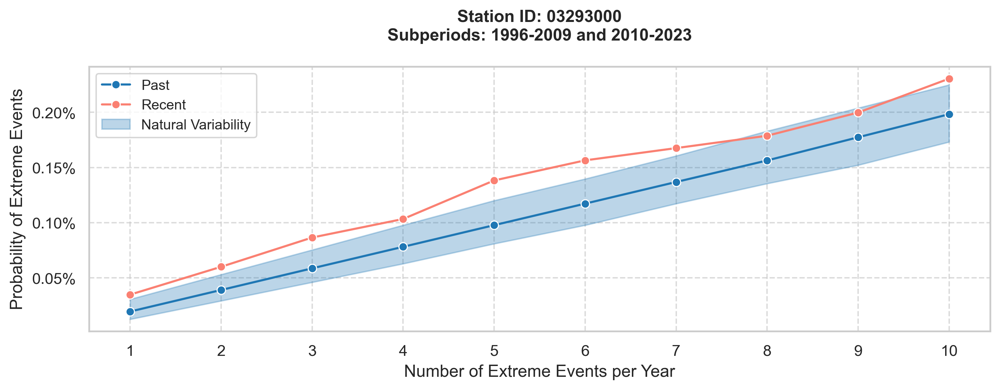

## About Me
I am a PhD candidate in the Hydrology Science program at the University of Wyoming and currently serve as president of the ASPRS UW student chapter.  
My academic and professional interests center on remote sensing, data science, geospatial analysis, hydrology, and climate change. I am passionate about exploring the intersections of these fields to address pressing environmental challenges and to advance our understanding of water resources in a changing climate.

***
## Education
📚 **PhD** 
Wyoming Geographic Information Science Center (WyGISC), UW, US (2022-now)  
🎓 **Master** 
Center for Space and Remote Sensing Research (CSRSR), NCU, Taiwan (2019-2021)  
🎓 **Bachelor** 
Department of Land Economics (Geomatics group), NCCU, Taiwan (2016-2019)  

***
## Dissertation Work
My PhD research investigates **how both climate and human activities influence urban flash flooding**. I focus on eight U.S. inland cities that have experienced the most severe flooding, selecting the specific HUC12 watersheds within these cities that have recorded the highest historical flood events. The figure below highlights the locations of these eight cities along with their corresponding study watersheds. 
 

To achieve the research objectives, the workflow is organized into two main phases:

**Phase 1: Trend Analysis in Extreme Precipitation and Flash Flooding (1996–2023)**

1. **Monte Carlo Simulation** 
   This step applies Monte Carlo methods to examine long-term trends in both the frequency and magnitude of extreme precipitation events. The simulation enables robust detection of shifts and variability in precipitation extremes over time.
2. **Attribution Analysis** 
   The focus is on determining whether the likelihood of flash flooding has changed over the study period. By comparing the recent period (2010–2023) to an earlier baseline (1996–2009), the analysis quantifies any changes in flash flood occurrence and account for natural variability using bootstrapping.

After both steps, I assessed the relationship between extreme precipitation trends and flash flooding risk. For example, in Louisville, KY, our findings highlight a distinct disconnect between these patterns: while the time series for extreme precipitation shows no significant changes in frequency or magnitude, severe flash flooding is now 1.8 times more likely to occur in the recent period. Moderate flash flooding has also increased, now 1.4 times more likely than before. The figure below illustrates that, throughout the recent period, flash flood probabilities consistently remain elevated compared to earlier years. 

 

This contrast underscores that heightened flash flood risk in Louisville is not solely explained by observed precipitation extremes, pointing to additional climate or anthropogenic factors influencing urban flood vulnerability, which leads me to my second phase of work.

**Phase 2: Data-Driven Assessment of Anthropogenic and Physical Controls on Urban Flash Flooding** 
In Phase 2, I will employ machine learning models to disentangle and quantify the contributions of diverse factors—including changes in land cover, the presence of human-built infrastructure, and intrinsic watershed characteristics—to flash flood occurrence and severity. This integrated analytical framework enables a deeper understanding of how urbanization and landscape modification amplify or mitigate flood risks, complementing the statistical trends established in Phase 1.

***
## Connect with Me
[My personal website](https://yenyiwu.wordpress.com/) | [LinkedIn](https://www.linkedin.com/in/yen-yi-wu/) | [Email me](mailto:ywu10@uwyo.edu)
